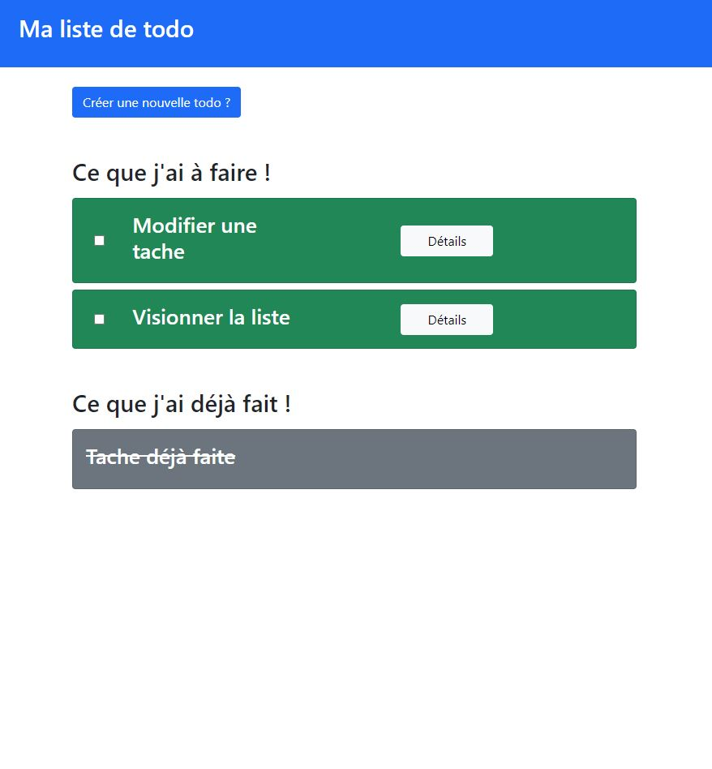
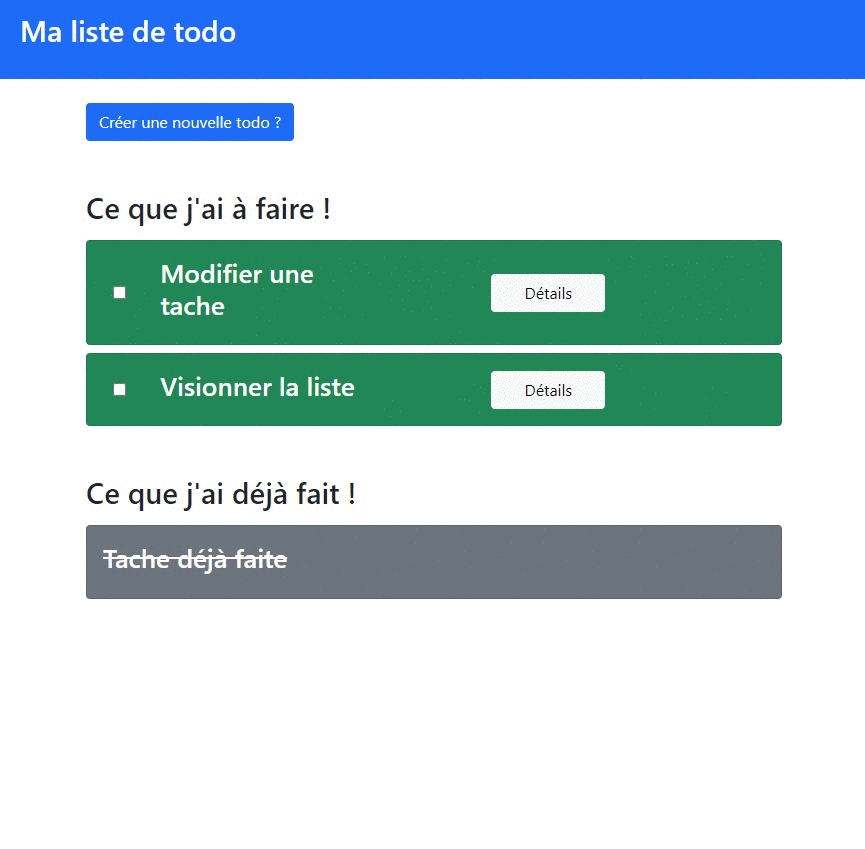
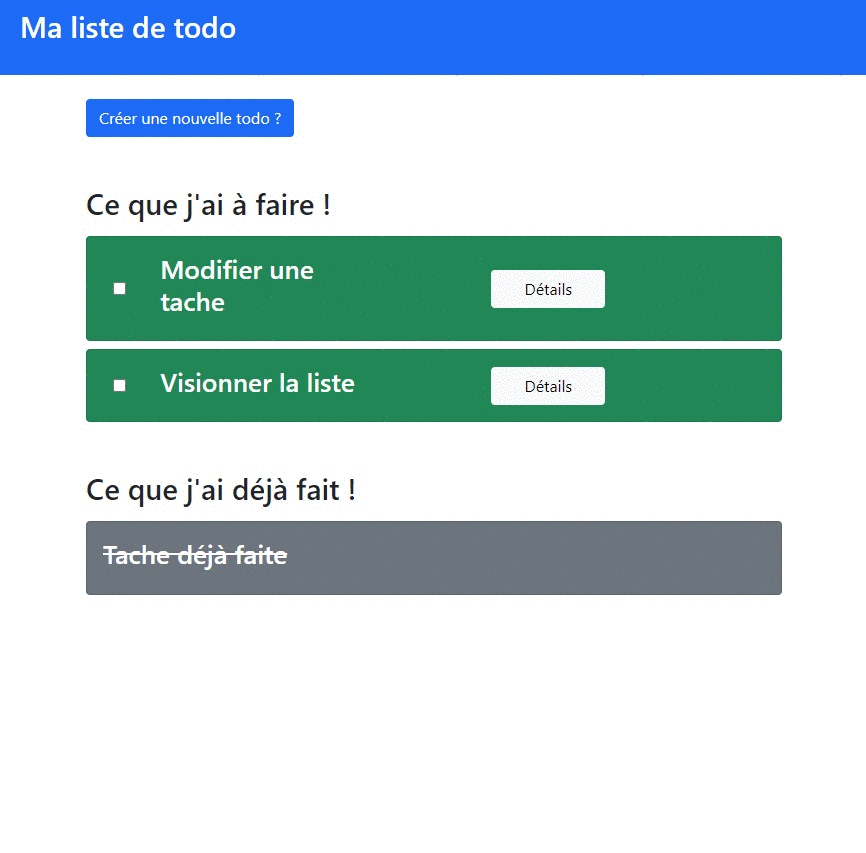
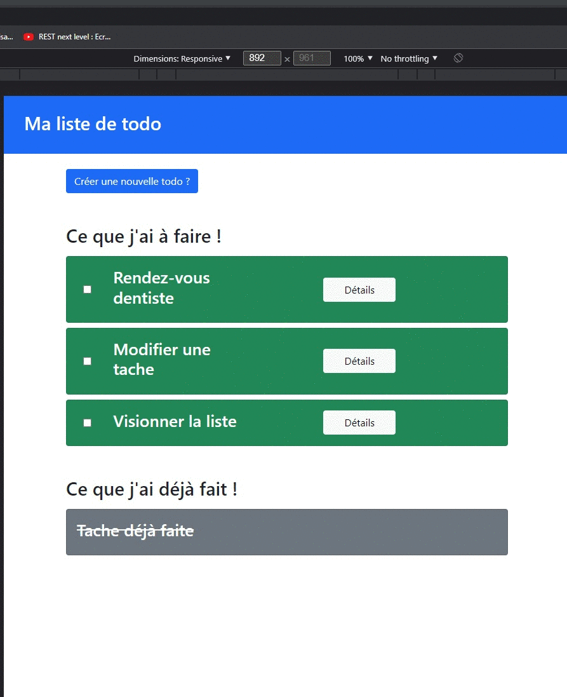

# Contexte
TODO FRONT est une applicatio web basée sur Angular permettant la gestion d'une todoList

## 1 : Environnement

### 1.2 : Fiche technique :

- Angular 13.
- Bootstrap 5

## 2 : Installation

-	1 : cloner le dépot
-	2 : placer vous dans le projet avec le terminal
-	3 : npm start

## 3 : Rendu

### 3.1 : List my TODOs

### 3.2 : Change a TODO state

### 3.3 : Detail a TODO

### 3.4 : Add a new TODO

Made by Laurent